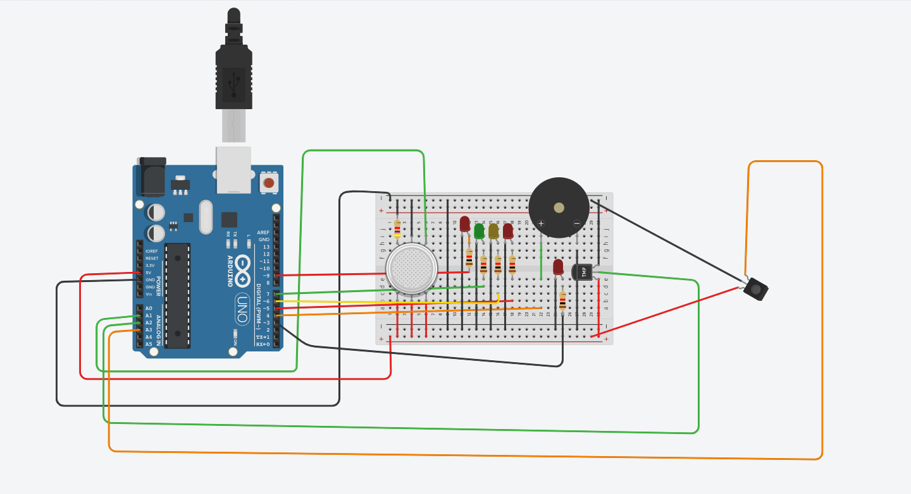

# Sensor Monitoring System 🔥🧪🌡️

A **microprocessor-based safety monitoring system** built using **Arduino**. This project is part of a course on **Microprocessors and Computer Architecture** and focuses on interpreting sensor data to detect **gas leaks**, **flames**, and **overheating**. It responds with **LED indicators** and a **buzzer alarm**.

> ⚠️ This is the **software-only** component of the system. Hardware connections (e.g. sensors, LEDs, buzzers) are assumed but not included in this repository.

---

## 📌 Features

- 🔍 Detects and evaluates:
  - Gas concentration (MQ2 sensor)
  - Flames (Flame sensor)
  - Temperature (LM35/TMP36 sensor)
- 🚨 Alerts:
  - Multi-level LED indicators
  - Buzzer alarm for hazards
- 🪵 Serial logging for live feedback
- 🧠 Sensor data interpretation using safe thresholds

---

## 🧰 Hardware Components (Not Included)

While this repository provides **only the software**, the full working system requires the following components:

| Component         | Arduino Pin | Description                      |
|------------------|-------------|----------------------------------|
| MQ2 Gas Sensor   | A1          | Analog gas concentration input  |
| Flame Sensor     | A3          | Analog flame detection signal   |
| Temperature Sensor (LM35) | A2 | Analog temperature input       |
| Green LED        | 7           | Indicates safe state            |
| Yellow LED       | 6           | Low gas warning                 |
| Red LEDs (x2)    | 5, 4        | High gas alert                  |
| Flame LED        | 9           | Flame detection indicator       |
| Temp LED         | 12          | High temperature alert          |
| Buzzer           | 3           | Audible alert output            |

---

## 🚀 How It Works

1. **Read Sensor Values** from analog inputs.
2. **Interpret Readings**:
   - Convert gas levels to percentage
   - Detect flame presence
   - Convert temperature to Celsius
3. **Evaluate Risk**:
   - Gas > 60% = Hazard
   - Flame detected = Emergency
   - Temp > 40°C = Overheat
4. **Respond**:
   - LEDs indicate risk levels
   - Buzzer sounds in alarm conditions
5. **Log status** to Serial Monitor

---

## 📂 File Structure

sensor-monitoring-system-mca/
├── sensor_monitoring_system.ino # Arduino code
├── README.md # Project documentation

---

## ✅ Sample Serial Output

-------- SENSOR READINGS --------
Raw MQ2 Value: 612 | Gas Concentration: 59%
Raw Flame Value: 73 | Flame Detected: YES
Temperature: 42.5 °C | Overheat: YES
Status: ALERT - FLAME TEMPERATURE

---

## 🛠️ Built With

- [Arduino UNO](https://www.arduino.cc/)
- [Arduino IDE](https://www.arduino.cc/en/software)
- [MQ2 Gas Sensor](https://components101.com/sensors/mq2-gas-sensor)
- [LM35 / TMP36](https://components101.com/sensors/lm35-temperature-sensor)

---

---

## 🔌 Hardware Wiring (Illustrative Only)

For a clearer understanding of the sensor and indicator wiring, refer to the schematic diagram below:

> **Note:** This diagram is a placeholder. You can replace it with an actual schematic (`circuit_diagram.png`) once you've wired the system on a breadboard or in a simulation tool like Tinkercad or Fritzing.

## 📜 License

This project is licensed under the MIT License.

---

## 🤝 Acknowledgment

This project was developed as part of the *Microprocessors & Computer Architecture* coursework.
